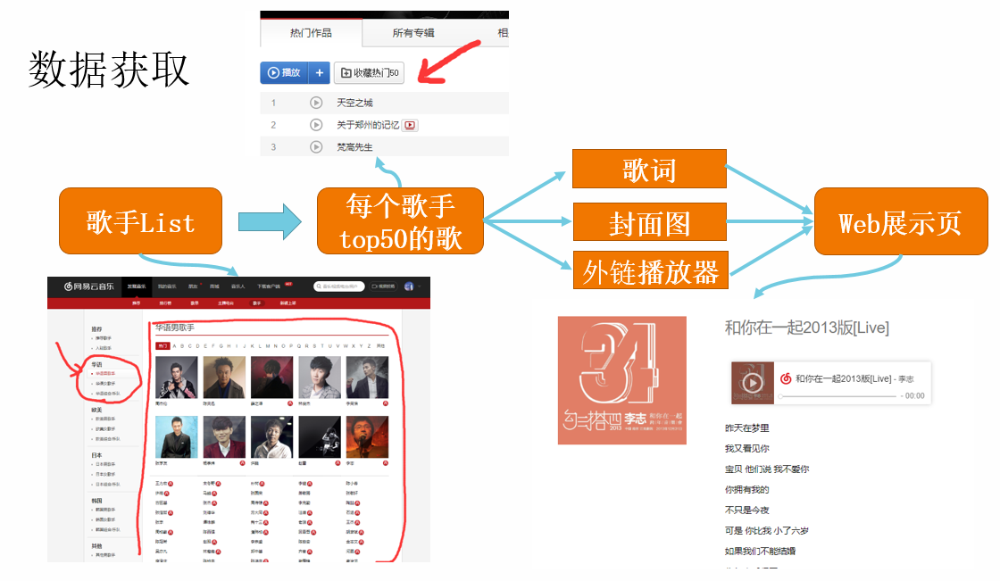
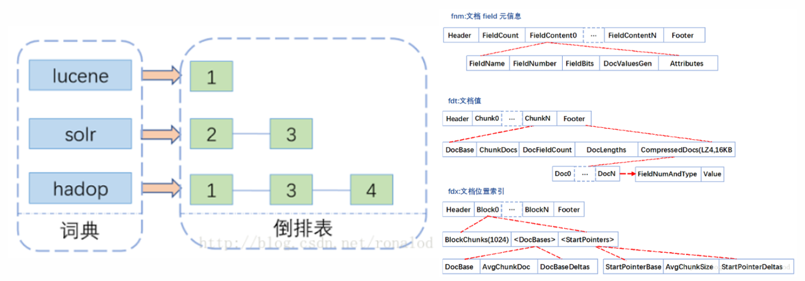
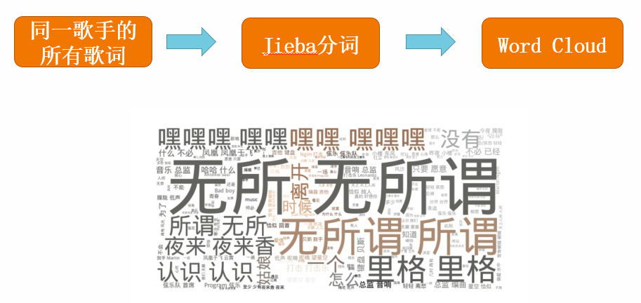
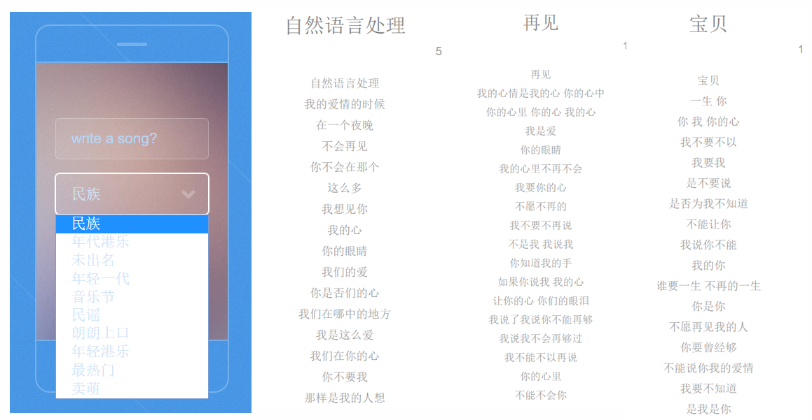

# Bibuying

陈伟文 51194501033

必不应: 爬取了网易云音乐top300的音乐人的各自top50的音乐，对其通过Elastic Search倒排索引建立一个搜索引擎，同时根据歌词词频与音乐人的介绍图片为每其画出词云，对于歌曲详情页面，显示其cd图片、歌词与网易云外链的播放器。最后讲音乐人分为几类，利用简单的RNN为每个类别训练一个模型，给一个关键字然后利用训练出的模型写一首看起来很成文的词。代码开源在[https://github.com/cww97/Bibuying](https://github.com/cww97/Bibuying).

## Quick Start

conda 建一个 Bibuying 环境 (python3.6)，activate， `pip install` [depedency](depedency)中的包,然后

	python manage.py runserver 0.0.0.0:8000

然后浏览器本地端口就可以了

## 数据爬取

从网易云爬歌手的热门50首歌,分类分别为华语男歌手、华语女歌手、华语组合/乐队，每个分类里有100个热门歌手，每个歌手50首歌，共15000 首歌，流程：

1. 获取歌手id表，存入artist_id.txt内
2. 获取每个歌手的50首热门歌曲id
3. 根据歌曲id爬歌词保存json文件

文件说明

- main.py：主要过程代码都在这
- artist_id.py: 歌手id文件，为get_artist_id()写出的文件
- web.html：爬取网页源码，先存在这看一眼，该文件未push
- get_ips.py：ip代理运营商提供的接口，自己机子被网易云列入黑名单了

首先 get_soup() 爬取 html 并转化为爬 BeautifulSoup 的格式，然后爬取歌手id进一步得到歌曲id。获得歌曲id后便可以得到每首歌的页面，在歌手页面其歌曲列表是js生成的html，直接爬会得到一堆js代码，需要对url加入一些trick，才可以完整加载歌词，爬得其歌曲信息（歌名、歌手名、歌词、封面图片等）并存入json文件中。同时将歌词jieba分词方便倒排索引。

主要流程就是这样，实际操作过程中发现网易云音乐有反爬虫机制，爬了五分钟自己ip被封了，画几块钱买个代理ip池，隔两分钟换一个ip爬，中间莫名的断了几次，耗时24小时，完成所有数据的爬取，数据在SongsData目录中。

## 简易搜索引擎

使用python的django框架快速建立web服务，由于检索的建立和索引的查找都是使用java实现，在写这部分的时候python调用java的模块还在调试，这里是本地写了一个search_result.txt, 该页面直接读取里面的song_id然后到SongsData中读取相应的json。后面java索引直接操作search_result.txt，当然直接返回一个list是最优雅的。详情页面比较简单，传进一个song_id, 建立页面里面有歌曲封面图片，歌词与网易云的一个外链播放器

  

## 画出词云

爬每个歌手的简介和图片，数据需要清洗一番才能用，然后把每个json里的歌词append进歌手的txt中，扔进jieba分词，接着生成了每个歌手的词云图片，web展示。

  

词云就很常规了，文件在ArtistsData目录下，歌手名.jpg是爬的歌手图片，作为词云的盖板，当然如果图片是白色的背景效果会很好，大部分歌手的图片背景都不是白色的，于是没有这么好的效果，理论上open_cv做个轮廓识别然后把外面涂白是可以达到这个效果的，随便放几个有意思的词云结果来展示一些把

  

## 利用RNN写歌

RNN因为其天然的对序列信息的敏感，天然的作为了NLP的基石。本文使用了其最简易版本CharRNN。因为一开始在数据爬取的时候一个音乐人只爬取了50首歌，练出一个可以看的模型，过于牵强，手动的讲歌手分类然后得到了一类音乐人的写作风格模型。给一个关键字写出整首歌，是RNN的一个基本操作了。

  
华语乐坛果然情歌泛滥

## 总结

本文从0开始完成了Bibuying这样一个山寨歌词搜索引擎，并有一些好玩的小功能比如词云、自动生成歌词等。经历的数据的爬取与清洗，分词与索引建立搜索引擎，词频统计生成词云，已经歌手分类RNN训练语言模型并用该模型生成歌词文本，全部耗时三个月。山不在高有仙则灵，麻雀虽小五脏俱全，至于后续改进，按照AI训练师的习惯数据都存在txt文件里，这导致我git push的时候想杀人，作为21世纪的软件工程师，要善于利用数据库。文本生成模型早就不是RNN可以完全满足的，新的方法比如squence GAN等等可以尝试，不过越是新的强的模型越是需要庞大的数据集，自己爬的这些已经满足不了需求了，另外小样本与弱监督最近都很火，说不定可以在不用更多数据的情况下训练出令人满意的模型。另一个点是只写了歌词，RNN可以处理任意序列的数据，那么歌曲的旋律、编曲等，是否也可以在传统方法的基础上加入这些元素从而达到amazing的效果。

## 以前版本的文档

- [report1: 倒排索引](doc/report1_index.md)
- [report2: 爬虫，词云](doc/report2_spider.md)
- [report3: RNN写歌](doc/report3_final.pdf)
- [README2017](doc/README_old.md)