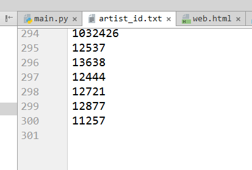
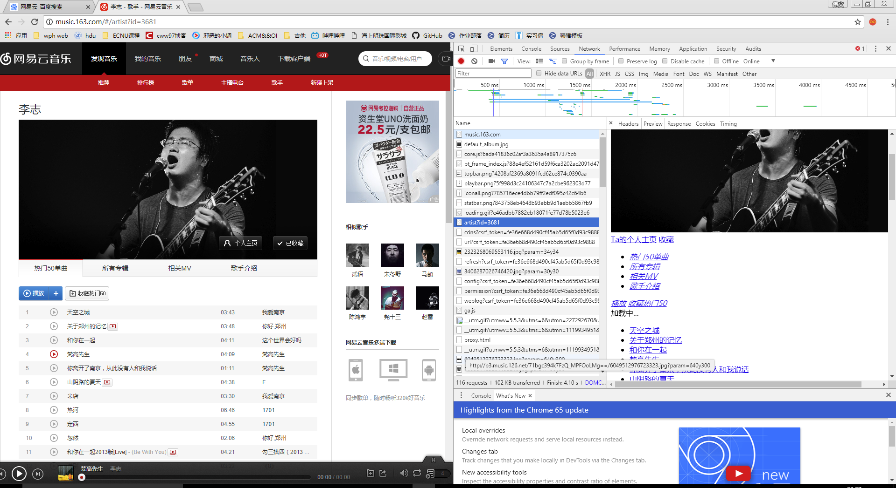
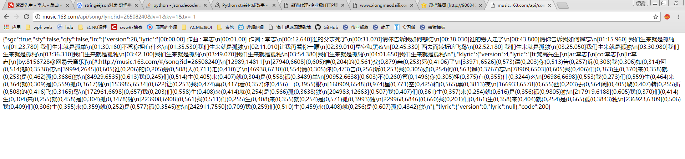
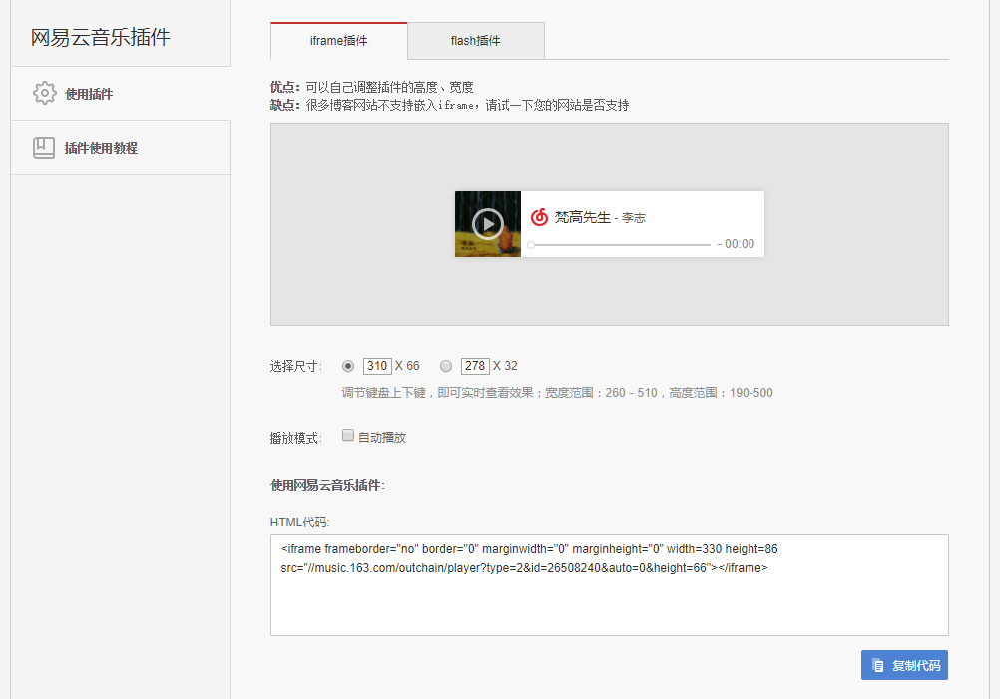
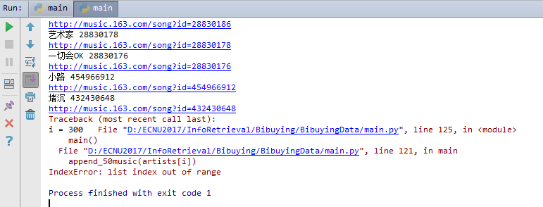
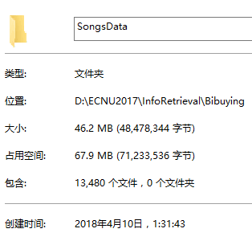
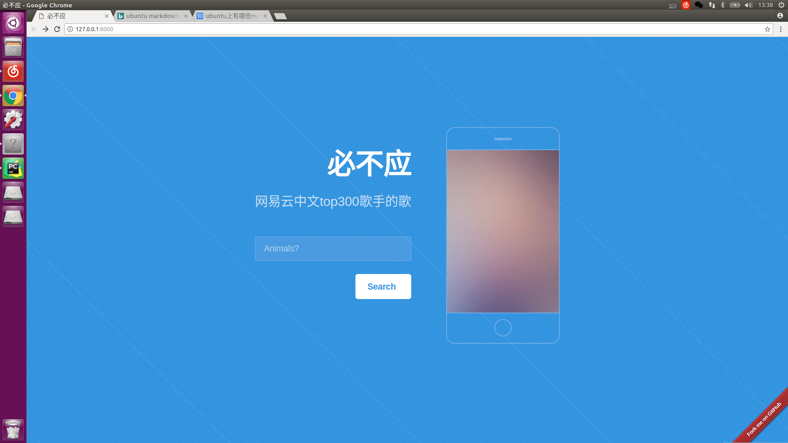
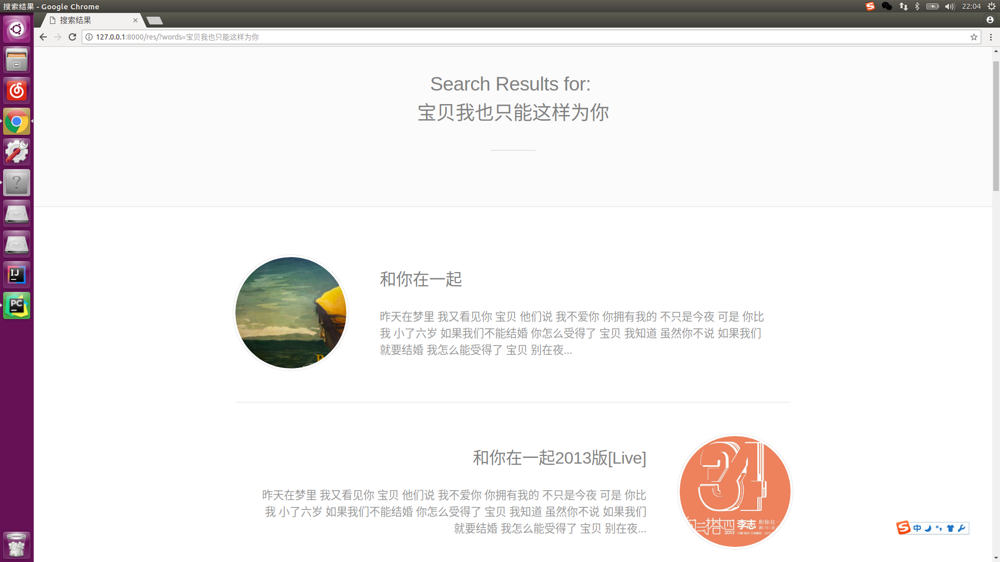
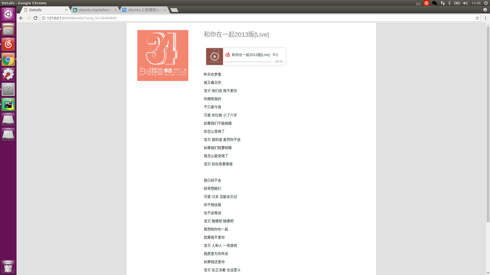
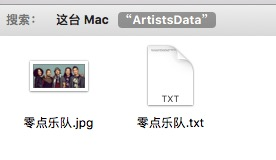

# Bibuying

we are [here](https://github.com/cww97/Bibuying)

第二次作业是爬虫，因为第一次已经在爬虫上下了不少功夫，因此第二次作业在第一次的基础上作一些拓展。

**华东师范大学 计算机科学与软件工程学院**

课程：信息检索

指导老师：[姚俊杰](http://junjie-yao.info/)

- 陈伟文 10152510217
- 徐洪义 10152510235
- 盛俊杰 10152510150


## 要求

第二次小组项目作业：

爬虫，一个特定的网站，爬出几W条数据，并对数据作一定分析

tips: 可以借助scrapy等爬虫框架

Deadline：5.27

## 项目环境

- ubuntu 16.04
- Anaconda(py3.6)
- pycharm (- -)
- django 1.11

## 快速开始


## 爬虫爬呀爬

从[网易云](http://music.163.com/)爬歌手的热门50首歌

分类分别为

- 华语男歌手
- 华语女歌手
- 华语组合/乐队

每个分类里有100个热门歌手，每个歌手50首歌

`3 * 100 * 50 = 15000 首歌`

数据量应该符合要求的10k

流程：

1. 获取歌手id表，存入`artist_id.txt`内 
2. 获取每个歌手的50首热门歌曲id 
3. 根据歌曲id爬歌词保存json文件

### 文件说明

`main.py`：主要过程代码都在这

`artist_id.py`: 歌手id文件，为`get_artist_id()`写出的文件

`web.html`：爬取网页源码，先存在这看一眼，该文件未push

`get_ips.py`：ip代理运营商提供的接口，自己机子被网易云列入黑名单了

## 基本操作

定义`get_soup()`爬取html：
```python
def get_soup(web_url):
	print(web_url)
	req = urllib.request.Request(url=web_url, headers=headers)
	# print(req)
	web_page = urllib.request.urlopen(req)
	data = web_page.read()
	soup = BeautifulSoup(data, 'lxml')
	f.write(soup.prettify())
	return soup
```

## 爬取歌手id

以华语男歌手为例，url：`http://music.163.com/discover/artist/cat?id=1001`
内有标签`<a class="nm nm-icn f-thide s-fc0" href=" /artist?id=3681" title="李志的音乐">`

于是有了下面两行

```python
ids = soup.find_all('a', attrs={"class": "nm nm-icn f-thide s-fc0"})
pattern = re.compile(r'id=\d+')
```

找到所有标签然后用正则表达式得到id

结果存在`artist_id.txt`中，如下：



## 根据id获取歌单

直接爬`http://music.163.com/#/artist?id=3681`有个问题，爬出来一堆js脚本，这个动态加载的页面

知乎上[这里](https://www.zhihu.com/question/21471960)发现个技巧，右击检查元素发现



这里有个请求可以得到歌单，其header如下

    Request URL: http://music.163.com/artist?id=3681
    Request Method: GET
    Status Code: 200 OK
    Remote Address: 223.252.199.66:80
    Referrer Policy: no-referrer-when-downgrade
    
emmmmm，把`#`扔掉就完事了

这里就面临一个选择，是把id存在一个本地文件里然后一行一行读来操作或者是直接在这里做到底，歌手歌名歌词搞完。

对接json文件，封面 + 歌词 + 音频链接 + 歌名 + 歌手名

### 歌曲封面

封面有个图片url，可以爬歌曲页面来获取html中的图片url

```python
def get_pic(song_id):
	song_url = 'http://music.163.com/song?id=%s' % str(song_id)
	soup = get_soup(song_url)
	st = soup.find('script', attrs={"type": "application/ld+json"}).text
	pat = re.compile(r'\"images\": \[.*\]')
	return pat.findall(st)[0][12:-2]
```

## 歌词

歌词找了半天，网易云有官方的接口

`http://music.163.com/api/song/lyric?id=%s&lv=1&kv=1&tv=-1`

直接get会得到这样一坨



需要正则表达式一通操作，如下

```python
def get_lyric(song_id):
	lyric_url = 'http://music.163.com/api/song/lyric?id=%s&lv=1&kv=1&tv=-1' % str(song_id)
	lyric = get_soup(lyric_url).text
	try:
		j = json.loads(lyric)
		try:
			lrc = j['lrc']['lyric']
			pat = re.compile(r'\[.*\]')
			return re.sub(pat, "", lrc).strip()
		except KeyError:
			return ""
	except json.decoder.JSONDecodeError:
		return ''
```

## 中文分词

将歌词分词，以供后面倒排索引使用。调用一下`jieba`，挺easy的

```python
def get_words(lyric):
	word_lst = []
	seg_list = jieba.cut(lyric, cut_all=True)
	for word in seg_list:
		if word != '' and not '\n' in word:
			word_lst.append(word)
	return word_lst
```

### 其他信息

歌手名，歌名在歌手歌单页面可以爬到
网易云有外链播放器功能，我想web搭建的时候，可以嵌一个



```
<iframe frameborder="no" border="0" marginwidth="0" marginheight="0" width=330 height=86 
src="//music.163.com/outchain/player?type=2&id=26508240&auto=0&height=66"></iframe>
```

只需要传入歌曲id就可以了

### 数据打包

打包为一个json文件，文件名为歌曲id，放在`SongsData`文件夹中

```python
def construct_song(artist_name, song_id, song_name):
	ans = {}
	ans["artist_name"] = artist_name
	ans["song_name"] = song_name
	ans['song_id'] = song_id
	ans['song_lyric'] = get_lyric(song_id)
	ans['pic_url'] = get_pic(song_id)
	ans['words'] = get_words(ans['song_lyric'])
	
	path = os.path.dirname(os.getcwd()) + '\\SongsData\\'
	json_str = repr(ans).replace('\'', '\"').replace(',', ',\n')
	file_name = '%s.json' % str(song_id)
	with open(path + file_name, 'w', encoding='utf-8') as w:
		w.write(json_str)
```

### ip问题

爬了10分钟之后发现自己电脑无法访问网易云了，代码没有写错，而是网易云封了我的ip（10分钟访问几千次可能要封）

于是乎，第二天在一个http代理的网站上买了1k个ip，爬废了一个ip换下一个

`get_soup()`改为:

```python
def get_soup(web_url):
	# html_file = open("web.html", "w", encoding='utf-8')
	if not 'lyric' in web_url: print(web_url)
	proxy = {"http": "http://" + ips[0], "https": "https://" + ips[0]}
	req = requests.get(url=web_url, headers=headers, proxies=proxy)
	soup = BeautifulSoup(req.text, 'lxml')
	# html_file.write(soup.prettify())
	return soup
```

`headers`加入`"Authorization": get_ips.auth`，为http运营商提供的接口

多了一个`get_ips.py`，ip的各种验证之类


### 数据完成

从9日晚上到10日晚上（爬的过程不是写代码的过程），

终于在凌晨看见了如下输出



300个歌手，应该是0到299，我还刻意写了`for i in range(0, 301)`，蠢了蠢了



共爬到13k的数据，数量级符合要求了，剩下的便是倒排索引和web展示了

## 检索界面

核心功能两个页面，搜索结果目录页和details页，有心情再搞个搜索主页

使用python的django框架，

### 搜索界面

感谢来自[遥遥姐姐](https://github.com/VivianLyy)的前端支持



### 搜索结果页面

由于检索的建立和索引的查找都是使用`java`实现，在写这部分的时候`python`调用`java`的模块还在调试，这里是本地写了一个`search_result.txt`, 该页面直接读取里面的`song_id`然后到`SongsData`中读取相应的`json`。

后面java索引直接操作`search_result.txt`，当然直接返回一个`list`是最优雅的，等调通了再做优化吧。



### 详情页面

传进一个song_id, 建立页面



## 为歌手生成常用词词云

首先看一下效果


很容易猜到这个男人喜欢穿皮裤

把所有歌词丢在一起，扔进jieba分词，然后生成词云。接着，计划web展示，但由于~~ddl没时间了~~,~~前端被打死了~~,~~天快亮了想睡觉了~~，种种原因，我们生成了每个歌手的词云图片，然后收工。下面一步一步讲~~我的头是如何秃的~~这些东西是怎么生成出来的。

### 再访网易云

这次爬的数据没有第一次那么多，需要每个歌手的名字，简介，图片，由于~~我很懒~~前面以及花了很多篇幅讲爬虫是怎么爬的，这里我很不要脸的贴代码了

爬一个歌手

```python
def get_artist_info(cur_id: int, path_name: str):
    soup = get_soup('http://music.163.com/artist?id=' + str(cur_id))
    artist_name = soup.find('h2', attrs={'class': 'sname f-thide sname-max'}).string

    # save image for each artist
    img = requests.get(soup.find('div', attrs={'class': 'n-artist f-cb'}).img['src'])
    image = Image.open(BytesIO(img.content))
    image.save('%s%s.jpg' % (path_name, artist_name))

    # save description for the artist
    txt_file = open('%s%s.txt' % (path_name, artist_name), 'w', encoding='utf-8')
    txt_file.write(soup.find(attrs={"name": "description"})['content'])

    print(artist_name)
```

外循环

```python
def get_artists_info():
    artists_id = get_artists()
    path_name = os.path.dirname(os.getcwd()) + '/ArtistsData/'
    cnt = 0
    for cur_id in artists_id:
        get_artist_info(cur_id, path_name)
        print('cnt = ' + str(cnt))
        cnt += 1
    print('done')
```

### 歌手名字

爬每个歌手的简介和图片，

对于第一次爬的歌曲信息，我再一次发现了一个令人想哭的情况，我的json只存了歌手名字没存歌手id，于是很尴尬的出现了几处歌手id一样名字不一样的尴尬情况，比如



爬下来的名字叫"零点"，emmm，还好此类数据不多，手工改一哈就好了

### 引号，上次留下的坑

之前导出的json初始状态是单引号，but这种文件`json.load()`就会炸，于是我写了后面让我在后面欲仙欲死的一句
```python
    data.replace('\'', '"')
```
于是乎，歌词里有很多单引号，然后，也被你`replace`掉了，


典型数据有：

    I'm
    don't
    let's
    ...我还可以继续不过我想你懂我意思了

接下来是为期一天的数据清洗，再replace回去，每行保留前三个和最后一个双引号，想法很好，然而，当我跑完如下代码后：
```python
def remove_extra_quotes(file):
    file_data = ''
    with open(file, "r", encoding="utf-8") as f:
        line_no = 0
        for line in f:
            line_no += 1
            if line_no == 5:
                new_line = list(line)
                # print(new_line)
                idx = []
                for i in range(len(line)):
                    if line[i] == '"': idx.append(i)
                if len(idx) == 4: continue
                # print(idx)
                idx = idx[1:-1]
                #print(idx)
                for i in idx:
                    new_line[i] = '\''
                line = ''.join(new_line)
            # print(line_no, ' ', line, end='')
            file_data += line
    with open(file, "w", encoding="utf-8") as f:
        f.write(file_data)
```

我发现当一行有四个引号的时候，这一行经过这个函数就会消失


一百个文件里大概四五个有这样的问题的，emm，手动改吧，改到凌晨3点听到一身闷雷，然后下起了雨。

### 组装歌手txt文件

在经历了上面的清洗，终于可以轻松run下面这个函数了

函数名就能看出，把每个json里的歌词append进歌手的txt中

```python
def give_songs_to_artists():
    songs_path = os.path.dirname(os.getcwd()) + '/SongsData/'
    artists_path = os.path.dirname(os.getcwd()) + '/ArtistsData/'
    song_files = os.listdir(songs_path)
    for i in range(2698, len(song_files)):
        if song_files[i] == 'fuck.py': continue
        print('%s (%d/%d)'% (song_files[i], i, len(song_files)))
        with open("%s%s" % (songs_path, song_files[i]), encoding='utf-8') as f:
            song = json.load(f)
            txt = []
            with open('%s%s.txt' % (artists_path, song['artist_name']),encoding='utf-8') as f_to:
                txt += f_to.readlines()
                txt.append('\n')
                txt.append(song['song_lyric'])
            with open('%s%s.txt' % (artists_path, song['artist_name']), 'w', encoding='utf-8') as f_to:
                # print(txt)
                f_to.writelines(txt)
```

###  词云词云

词云就很常规了，翻下自己的~~祖传~~,~~去年写的~~代码，发现自己分词方法很naive，怪不得当时有很多长句子，如下

```python
def get_word_cloud(path_name, file_name):
    # get text && get fonts & mask_image
    text = open(path_name + file_name + '.txt', "r", encoding='utf-8').read()
    text = ' '.join(jieba.cut(text, cut_all=True))
    font = os.path.join(os.path.dirname(__file__), "DroidSansFallbackFull.ttf")
    coloring = np.array(Image.open(path.join(d, path_name + file_name + '.jpg')))
    # coloring = np.array(Image.open(path.join(d, 'bg.png')))
    # set stopwords
    stopwords = set(STOPWORDS)
    ignore_words = ['作曲', '作词', '制作', '作人', '乐队']
    ignore_words.append(file_name)
    for item in ignore_words:
        stopwords.add(item)

    # Generate a word cloud image
    wordcloud = WordCloud(background_color="white", font_path=font, stopwords=stopwords,
                          mask=coloring, random_state=2, margin=1).generate(text)
    wordcloud = wordcloud.recolor(color_func=ImageColorGenerator(coloring))

    # Display the generated image, the matplotlib way:
    plt.imshow(wordcloud,interpolation='bilinear')
    plt.axis("off")
    plt.savefig(path_name + file_name + '0.jpg')
    # plt.show()
    plt.close()
```

再套一个外循环，一个txt生成一个，完结撒花，文件在`ArtistsData`目录下，歌手名.jpg是爬的歌手图片，作为词云的盖板，当然如果图片是白色的背景效果会很好，如下


大部分歌手的图片背景都不是白色的，于是没有这么好的效果，理论上open_cv做个轮廓识别然后把外面涂白是可以达到这个效果的，但是~~ddl到了要交了~~咱们这次作业的主题是爬虫不是这个是不是,于是，随便放几个有意思的词云结果来展示一些把

费玉清


中国人民解放军军乐团


李志


更多彩蛋欢迎前往`Artists`目录自行挖掘


## 参考文献

[NetCloud Music](http://music.163.com)

[BeautifulSoup](https://www.crummy.com/software/BeautifulSoup/bs4/doc/index.zh.html)

[python爬取网易云歌词](https://www.cnblogs.com/Beyond-Ricky/p/6757954.html)

[python 爬去js生成的网页内容](https://www.zhihu.com/question/21471960)

[熊猫代理HTTP](http://www.xiongmaodaili.com/)

[ElasticSearch py](https://pypi.python.org/pypi/elasticsearch/2.2.0)

[django教程 | 菜鸟教程](http://www.runoob.com/django/django-tutorial.html)

[python 词云](https://www.jianshu.com/p/e4b24a734ccc)
