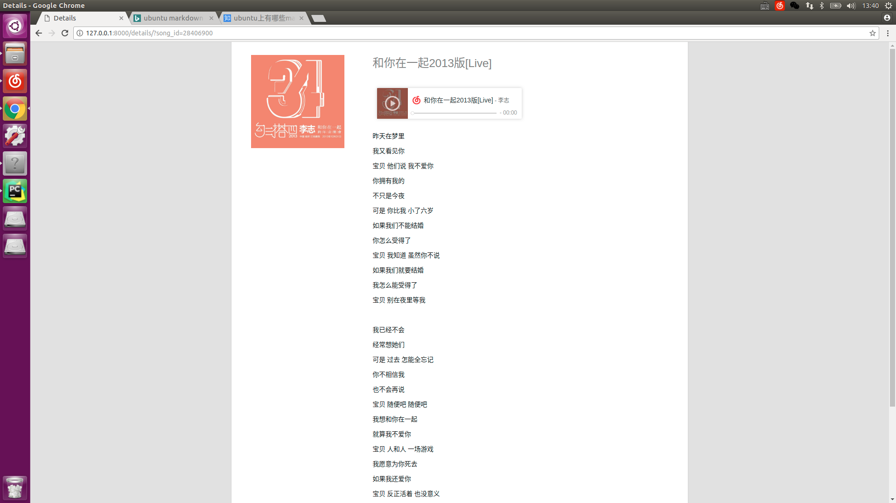
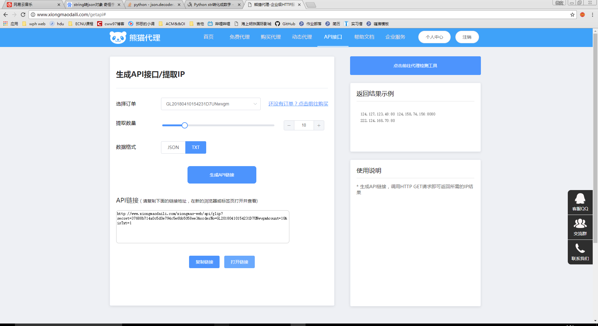
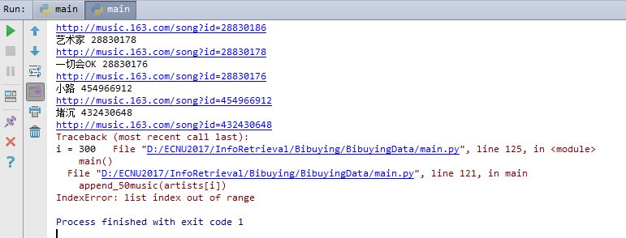
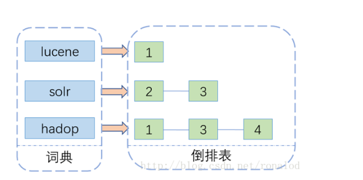
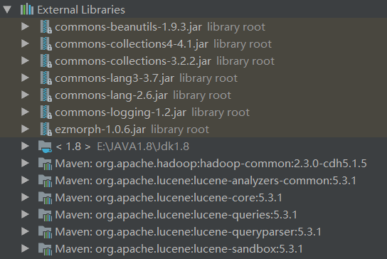
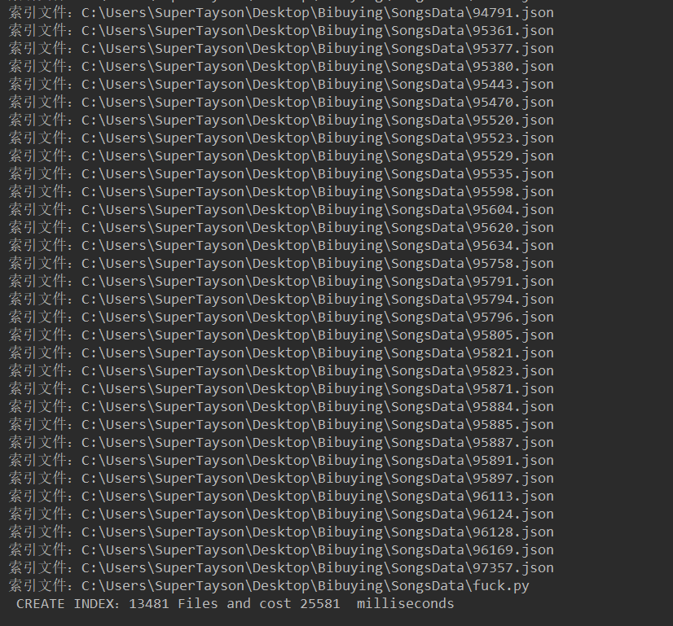
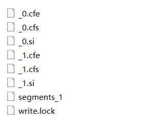
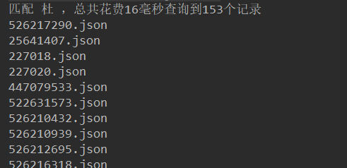

# Bibuying

we are [here](https://github.com/cww97/Bibuying)

由于彭先生起了“十度”这个名字

我们顺势起了个“必不应”，大家都是假的搜索引擎

华东师范大学 计算机科学与软件工程学院

课程：信息检索

指导老师：[姚俊杰](http://junjie-yao.info/)

- 陈伟文 10152510217
- 徐洪义 10152510235
- 盛俊杰 10152510150

## 快速开始

贴几张图，我想大部分人是不会翻到最底下看这几张图的




## 要求

第一次小组项目作业：

`Lucene`倒排检索，给定一个不少于10k条的文本数据集，实现创建索引和检索功能。

加分项：中文语料、检索界面`web`化， 或借助`solr`，`elastic`等工具。

Deadline：4月15日。

## 项目环境

- ubuntu 16.04
- Anaconda(py3.6)
- pycharm (- -)
- django 1.11

## 数据来源

// this part is edited by cww

从[网易云](http://music.163.com/)爬歌手的热门50首歌

分类分别为

- 华语男歌手
- 华语女歌手
- 华语组合/乐队

每个分类里有100个热门歌手，每个歌手50首歌

`3 * 100 * 50 = 15000 首歌`

数据量应该符合要求的10k

流程：

1. 获取歌手id表，存入`artist_id.txt`内 
2. 获取每个歌手的50首热门歌曲id 
3. 根据歌曲id爬歌词保存json文件

### 文件说明

`main.py`：主要过程代码都在这

`artist_id.py`: 歌手id文件，为`get_artist_id()`写出的文件

`web.html`：爬取网页源码，先存在这看一眼，该文件未push

`get_ips.py`：ip代理运营商提供的接口，自己机子被网易云列入黑名单了

### 基本操作

定义`get_soup()`爬取html：
```python
def get_soup(web_url):
	print(web_url)
	req = urllib.request.Request(url=web_url, headers=headers)
	# print(req)
	web_page = urllib.request.urlopen(req)
	data = web_page.read()
	soup = BeautifulSoup(data, 'lxml')
	f.write(soup.prettify())
	return soup
```

### 爬取歌手id

以华语男歌手为例，url：`http://music.163.com/discover/artist/cat?id=1001`
内有标签`<a class="nm nm-icn f-thide s-fc0" href=" /artist?id=3681" title="李志的音乐">`

于是有了下面两行
```python
ids = soup.find_all('a', attrs={"class": "nm nm-icn f-thide s-fc0"})
pattern = re.compile(r'id=\d+')
```
找到所有标签然后用正则表达式得到id

结果存在`artist_id.txt`中，如下：


### 根据id获取歌单

直接爬`http://music.163.com/#/artist?id=3681`有个问题，爬出来一堆js脚本，这个动态加载的页面

知乎上[这里](https://www.zhihu.com/question/21471960)发现个技巧，右击检查元素发现


这里有个请求可以得到歌单，其header如下

    Request URL: http://music.163.com/artist?id=3681
    Request Method: GET
    Status Code: 200 OK
    Remote Address: 223.252.199.66:80
    Referrer Policy: no-referrer-when-downgrade
    
emmmmm，把`#`扔掉就完事了

这里就面临一个选择，是把id存在一个本地文件里然后一行一行读来操作或者是直接在这里做到底，歌手歌名歌词搞完。

对接json文件，封面 + 歌词 + 音频链接 + 歌名 + 歌手名

### 歌曲封面

封面有个图片url，可以爬歌曲页面来获取html中的图片url

```python
def get_pic(song_id):
	song_url = 'http://music.163.com/song?id=%s' % str(song_id)
	soup = get_soup(song_url)
	st = soup.find('script', attrs={"type": "application/ld+json"}).text
	pat = re.compile(r'\"images\": \[.*\]')
	return pat.findall(st)[0][12:-2]
```

### 歌词

歌词找了半天，网易云有官方的接口

`http://music.163.com/api/song/lyric?id=%s&lv=1&kv=1&tv=-1`

直接get会得到这样一坨


需要正则表达式一通操作，如下

```python
def get_lyric(song_id):
	lyric_url = 'http://music.163.com/api/song/lyric?id=%s&lv=1&kv=1&tv=-1' % str(song_id)
	lyric = get_soup(lyric_url).text
	try:
		j = json.loads(lyric)
		try:
			lrc = j['lrc']['lyric']
			pat = re.compile(r'\[.*\]')
			return re.sub(pat, "", lrc).strip()
		except KeyError:
			return ""
	except json.decoder.JSONDecodeError:
		return ''
```

### 中文分词

将歌词分词，以供后面倒排索引使用。调用一下`jieba`，挺easy的

```python
def get_words(lyric):
	word_lst = []
	seg_list = jieba.cut(lyric, cut_all=True)
	for word in seg_list:
		if word != '' and not '\n' in word:
			word_lst.append(word)
	return word_lst
```

### 其他信息

歌手名，歌名在歌手歌单页面可以爬到
网易云有外链播放器功能，我想web搭建的时候，可以嵌一个


```
<iframe frameborder="no" border="0" marginwidth="0" marginheight="0" width=330 height=86 
src="//music.163.com/outchain/player?type=2&id=26508240&auto=0&height=66"></iframe>
```

只需要传入歌曲id就可以了

### 数据打包

打包为一个json文件，文件名为歌曲id，放在`SongsData`文件夹中

```python
def construct_song(artist_name, song_id, song_name):
	ans = {}
	ans["artist_name"] = artist_name
	ans["song_name"] = song_name
	ans['song_id'] = song_id
	ans['song_lyric'] = get_lyric(song_id)
	ans['pic_url'] = get_pic(song_id)
	ans['words'] = get_words(ans['song_lyric'])
	
	path = os.path.dirname(os.getcwd()) + '\\SongsData\\'
	json_str = repr(ans).replace('\'', '\"').replace(',', ',\n')
	file_name = '%s.json' % str(song_id)
	with open(path + file_name, 'w', encoding='utf-8') as w:
		w.write(json_str)
```

### ip问题

爬了10分钟之后发现自己电脑无法访问网易云了，代码没有写错，而是网易云封了我的ip（10分钟访问几千次可能要封）

于是乎，第二天在一个http代理的网站上买了1k个ip，爬废了一个ip换下一个

`get_soup()`改为:

```python
def get_soup(web_url):
	# html_file = open("web.html", "w", encoding='utf-8')
	if not 'lyric' in web_url: print(web_url)
	proxy = {"http": "http://" + ips[0], "https": "https://" + ips[0]}
	req = requests.get(url=web_url, headers=headers, proxies=proxy)
	soup = BeautifulSoup(req.text, 'lxml')
	# html_file.write(soup.prettify())
	return soup
```

`headers`加入`"Authorization": get_ips.auth`，为http运营商提供的接口

多了一个`get_ips.py`，ip的各种验证之类



### 数据完成

从9日晚上到10日晚上（爬的过程不是写代码的过程），

终于在凌晨看见了如下输出



300个歌手，应该是0到299，我还刻意写了`for i in range(0, 301)`，蠢了蠢了


共爬到13k的数据，数量级符合要求了，剩下的便是倒排索引和web展示了

// 2018/04/11


## 数据索引

由于前面使用的py进行操作，以及网页的搭建也是python,而倒排索引部分是使用java进行实现。所以之后还有python通过JPype调用java函数的步骤。
倒排索引的原理已经十分清楚，就不在这里多加阐述，主要展示我们如何实现。




（1）创建索引


 构造方法 实例化IndexWriter
```java
public Indexer(String indexDir)throws Exception{
	Directory dir=FSDirectory.open(Paths.get(indexDir));
	// 标准分词器
	Analyzer analyzer=new StandardAnalyzer();
	IndexWriterConfig iwc=new IndexWriterConfig(analyzer);
	writer=new IndexWriter(dir, iwc);
}
```

索引指定目录的所有文件,dataDir为需要进行索引的目录

```java
public int index(String dataDir)throws Exception{
	//遍历索引目录下的所有文件
	File []files=new File(dataDir).listFiles();
	for(File f:files){
		indexFile(f);
	}
	//返回索引的文件数量
	return writer.numDocs();
}
```

索引指定文件

```java
private void indexFile(File f) throws Exception{
	System.out.println("索引文件："+f.getCanonicalPath());
	//这里有一个概念：索引的时候，它会像数据里行和列一样
	//一行、一行，这里一行就是一个Document，一个文档，文档里又有列
	Document doc=getDocument(f);
	writer.addDocument(doc);
}
```


获取文档，文档里再设置每个字段

```java
private Document getDocument(File f)throws Exception {
	Document doc=new Document();
	FileReader fr=new FileReader(f);

	doc.add(new TextField("contents",new FileReader(f)));
	doc.add(new TextField("fileName", f.getName(),Field.Store.YES));
	//fullPath 完整路径
	doc.add(new TextField("fullPath",f.getCanonicalPath(),Field.Store.YES));

	return doc;
}
```

测试创建索引

```java
public static void main(String[] args) {
	//索引输出目录
	//		String indexDir="E:\\Bibuying";
	String indexDir="C:\\Users\\SuperTayson\\Desktop\\Bibuying\\DataIndex";
	//读取数据的路径
	String dataDir="E:\\Bibuying\\SongsData";
	String dataDir="C:\\Users\\SuperTayson\\Desktop\\Bibuying\\SongsData";

	Indexer indexer=null;
	int numIndexed=0;
	long start=System.currentTimeMillis();
	try {
		indexer = new Indexer(indexDir);
		numIndexed=indexer.index(dataDir);
	} catch (Exception e) {
		e.printStackTrace();
	}finally{
		try {
			indexer.close();
		} catch (Exception e) {
			e.printStackTrace();
		}
	}
	long end=System.currentTimeMillis();
	System.out.println(" CREATE INDEX："+numIndexed+" Files and cost "+(end-start)+"  milliseconds");
}
```


外部添加的Lucene支持相关jar包：




创建索引的结果：




如图，一共检索了13481个文件并创建了索引，花时25.581秒。


成功创建的索引文件：




（2）索引检索


通过第一步创建好了索引，那么接下来只需要将所要搜素的内容在索引文件中进行查找匹配即可。

索引函数Search

```java
public class Searcher {

	public static void search(String indexDir,String q)throws Exception{
		Directory dir=FSDirectory.open(Paths.get(indexDir));
		//创建索引读取器
		IndexReader reader=DirectoryReader.open(dir);
		//创建索引查询器
		IndexSearcher is=new IndexSearcher(reader);
		// 标准分词器
		Analyzer analyzer=new StandardAnalyzer();
		//开始查询解析
		QueryParser parser=new QueryParser("contents", analyzer);
		Query query=parser.parse(q);

		long start=System.currentTimeMillis();
		TopDocs hits=is.search(query, 10);
		long end=System.currentTimeMillis();
		System.out.println("匹配 "+q+" ，总共花费"+(end-start)+"毫秒"+"查询到"+hits.totalHits+"个记录");
		for(ScoreDoc scoreDoc:hits.scoreDocs){
			Document doc=is.doc(scoreDoc.doc);
			System.out.println(doc.get("fileName"));

		}
		reader.close();
	}
```

实例测试

```java
public static void main(String[] args) {
	//索引存放路径
	String indexDir="C:\\Users\\SuperTayson\\Desktop\\Bibuying\\DataIndex";
	//查询字段
	String q=search1;
	try {
		search(indexDir,q);
	} catch (Exception e) {
		e.printStackTrace();
	}
}
```


索引结果：



如图，这里根据关键字索引得到了对应文件的文件名，用于之后网页的结果显示。


## Python通过JPype调用JAVA倒排索引的实习

该部分作为本次项目最难解决的问题，没有之一。有必要进行较为详细的讲解。

###JPype的下载和安装

首先尝试使用命令pip install jpype1安装jpype。

出现如下情况：

    creating build\lib.win-amd64-3.5\jpypex
    copying jpypex\__init__.py -> build\lib.win-amd64-3.5\jpypex
    creating build\lib.win-amd64-3.5\jpypex\swing
    copying jpypex\swing\AbstractAction.py -> build\lib.win-amd64-3.5\jpypex\swing
    copying jpypex\swing\pyutils.py -> build\lib.win-amd64-3.5\jpypex\swing
    copying jpypex\swing\__init__.py -> build\lib.win-amd64-3.5\jpypex\swing
    running build_ext
    building '_jpype' extension
    error: Unable to find vcvarsall.bat
	Command "c:\users\xyb-c308\appdata\local\programs\python\python35\python.exe -u-c "import setuptools, tokenize;__file__='C:\\Users\\xyb-C308\\AppData\\Local\\T
	emp\\pip-build-cnhdb_jq\\jpype1\\setup.py';f=getattr(tokenize, 'open', open)(__f
	ile__);code=f.read().replace('\r\n', '\n');f.close();exec(compile(code, __file__
	, 'exec'))" install --record C:\Users\xyb-C308\AppData\Local\Temp\pip-h1e28641-r
	ecord\install-record.txt --single-version-externally-managed --compile" failed w
	ith error code 1 in C:\Users\xyb-C308\AppData\Local\Temp\pip-build-cnhdb_jq\jpyp
	e1\

百度之，说明没有安装visual C++编译器

耗费了大半天的时间，一直在纠结如何通过VS C++的插件导致 pip install jpype1 失败的问题。

于是，下载VS C++ 插件，安装完成后，在Python 36路径下，再次使用 pip install jpype1 安装，发现又报错

	‘cl.exe’ failed (error code 1 exit status 2)

google之，根据提示，在已经安装的VS C++ tool的cmd prompt 中，输入 pip install jpype1 安装，
以为万事大吉了，可是高兴太早，仍然报错。

		**jpype_javaarray.obj : error LNK2001: unresolved external symbol __imp___Py_NoneStruct
		error: command
		‘C:\Program Files (x86)\Microsoft\Visual Studio\14.0\VC\BIN\amd64\link.exe’ failed with exit status 1120’**


各种VS C++的补丁已经安装，不知道卸载了几回，安装了几回，依旧无用。

就快要放弃的时候，手动安装 不也可以嘛？
于是，网上下载 jpype1 相关的库文件，相对比较容易找到，
下载后，手动安装jpype1 ，其实，仍然是心虚的。

首先，手动安装 wheel

之后，待wheel安装成功后，再次安装已经下载的 JPype1-0.6.2-cp36-cp36m-win_amd64.whl 文件

3以为可以成功了，运行简单的调用jvm脚本，发现仍有错误，不过已经可以看到曙光啦

	ImportError: numpy.core.multiarray failed to import

通过上述的error，可以判断应该是缺少numpy 库，于是再次安装 pip

完成后，import jpype
不再报error，于是，运行以下的code，验证我们的python调用jvm

```python
 _*_ coding:utf-8 _*_
import jpype

jvmPath = jpype.getDefaultJVMPath()       # 默认的JVM路径
print(jvmPath)
jpype.startJVM(jvmPath)
jpype.java.lang.System.out.println("hello world!")

jpype.shutdownJVM()
```
运行成功，说明jpype 安装成功！

### JPype的调用

获得默认jvm路径，即jvm.dll文件路径；设置JVM的jvmArg，启动Java虚拟机

```python
from jpype import getDefaultJVMPath
from jpype import isJVMStarted
from jpype import startJVM
from jpype import JClass
from jpype import JavaException
from jpype import shutdownJVM
import jpype
import os.path
global javaClass

def query(words):
	jvmPath = getDefaultJVMPath()  # the path of jvm.dll
	classpath = os.getcwd() + "/BibuyingIndex/" + "/Lucene-Demo/classes/artifacts/Lucene_Demo_jar/Lucene-Demo.jar"
	print(classpath)
	jvmArg = "-Djava.class.path=" + classpath
	if not isJVMStarted():
		startJVM(jvmPath, "-ea" , jvmArg)
```

获取相应的Java类

```python
jpype.attachThreadToJVM()
javaClass = JClass("com.java.lucene.control")
print(words)
```
调用Java方法，将网页中输入的关键词传入索引查找，进行结果匹配。

```python
try:
    javaClass.search(words)
except JavaException as e:
    print("Caught exception : ", JavaException.message())
    print(JavaException.stackTrace())
finally:
shutdownJVM()  # shut down JVM
```

索引结果见下一章

## 检索界面

核心功能两个页面，搜索结果目录页和details页，有心情再搞个搜索主页

使用python的django框架，

### 搜索界面

感谢来自[遥遥姐姐](https://github.com/VivianLyy)的前端支持


### 搜索结果页面

由于检索的建立和索引的查找都是使用`java`实现，在写这部分的时候`python`调用`java`的模块还在调试，这里是本地写了一个`search_result.txt`, 该页面直接读取里面的`song_id`然后到`SongsData`中读取相应的`json`。

后面java索引直接操作`search_result.txt`，当然直接返回一个`list`是最优雅的，等调通了再做优化吧。


### 详情页面

传进一个song_id, 建立页面


## 再说点什么

可能未解决的问题：如果运行时出现`Json Decode Error`，可以尝试看看日志。
多半是歌词里有奇奇怪怪的字符，比如双引号或者'\xa0'，

`SongsData/fuck.py`里面有类似的代码，如有兴趣，修改该json, pull request, 感激不尽

## 参考文献

[NetCloud Music](http://music.163.com)

[BeautifulSoup](https://www.crummy.com/software/BeautifulSoup/bs4/doc/index.zh.html)

[python爬取网易云歌词](https://www.cnblogs.com/Beyond-Ricky/p/6757954.html)

[python 爬去js生成的网页内容](https://www.zhihu.com/question/21471960)

[熊猫代理HTTP](http://www.xiongmaodaili.com/)

[ElasticSearch py](https://pypi.python.org/pypi/elasticsearch/2.2.0)

[django教程 | 菜鸟教程](http://www.runoob.com/django/django-tutorial.html)
